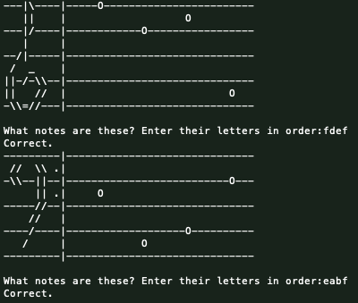
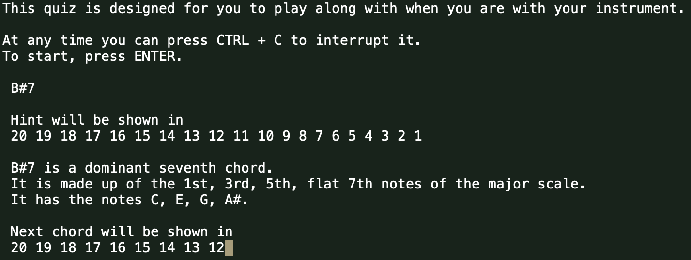

# Learn to read music

I'm learning to play the piano. 

It's taking me some time to learn to read music. So, I decided to build a python script to help me with this.
Later this repo evolved into a separate quiz to practice playing various things.

I wrote most of this pretty smashed, so if you stumble across this then please don't judge me on my hacky coding style.
 \*_Rick burp_\*
 
If you find these quizzes useful, [I'd love to hear from you on twitter](https://twitter.com/messages/compose?recipient_id=21296084).

## Reading quiz

This quiz is designed for use when you're not at a piano, to practice reading random notes on sheet music.
```
python reading_quiz.py
```



## Playing quiz

This quiz is designed for when you're with your instrument, to practice various random chords. 
It will automatically proceed to the next chord, but there's an option to manually proceed hidden in the code.

```
python playing_quiz.py
```

